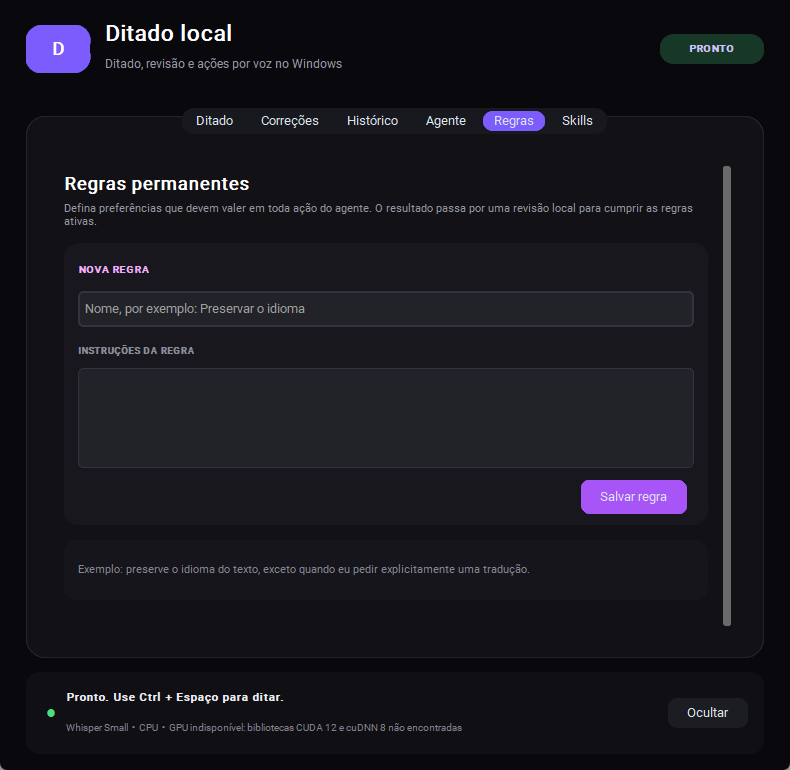

# Ditado Local

Ditado e transformação de texto por voz no Windows, com processamento local usando
Faster Whisper e Ollama.



## O que o aplicativo faz

- Segure `Ctrl + Espaço` para ditar em qualquer aplicativo.
- Selecione um texto e segure `Ctrl esquerdo + Alt esquerdo` para transformá-lo por voz.
- Escolha detecção automática ou fixe o idioma da transcrição.
- Cadastre correções de grafia para nomes, marcas e termos técnicos.
- Crie regras permanentes para preferências que devem valer em todas as ações.
- Crie skills acionadas por nome ou frase para fluxos específicos.
- Continue respostas do agente em um mini chat aberto pela aba `Histórico`.
- Use CPU automaticamente quando a aceleração por GPU não estiver disponível.
- Mantenha um histórico local protegido pela conta atual do Windows.
- Sincronize opcionalmente correções, regras, skills e histórico entre PCs, com
  contas separadas e criptografia ponta a ponta.

Novas instalações não recebem regras, termos ou preferências pessoais do autor.

## Instalação rápida

### 1. Requisitos

- Windows 10 ou Windows 11 de 64 bits.
- Python 3.11 ou 3.12 disponível pelo comando `py` ou `python`.
- Microfone.
- Conexão com a internet durante a instalação e no primeiro download dos modelos.

Ollama é opcional para o ditado básico e necessário para revisão gramatical, regras,
skills e ações sobre texto selecionado. Se ele não estiver instalado, a aba Agente
explica o problema e oferece o botão **Instalar Ollama**. O aplicativo usa o WinGet
do Windows para instalar o pacote oficial, inicia o serviço local e baixa o modelo
padrão. Se o Ollama já estiver instalado ou faltar apenas o modelo, a ação muda para
**Iniciar Ollama** ou **Baixar modelo**.

Também é possível fazer a configuração manual pelo
[instalador oficial do Ollama](https://ollama.com/download/windows) e pelo comando:

```powershell
ollama pull qwen3:4b-instruct
```

### 2. Baixe e instale

Baixe o arquivo `DitadoLocal-<versão>.zip` na página de Releases, extraia e execute:

```powershell
powershell -ExecutionPolicy Bypass -File .\install.ps1
```

O instalador habilita a inicialização automática com o Windows por padrão. Para
instalar sem esse comportamento:

```powershell
powershell -ExecutionPolicy Bypass -File .\install.ps1 -StartWithWindows:$false
```

O instalador cria um ambiente Python isolado em
`%LOCALAPPDATA%\faster-whisper`, preserva configurações existentes e adiciona
`Ditado Local` ao menu Iniciar e à pasta Inicializar.

## Como usar

### Ditado

1. Coloque o cursor no campo em que deseja escrever.
2. Segure `Ctrl + Espaço`.
3. Fale e solte `Espaço`.
4. O texto é copiado e, quando habilitado, colado se o campo original ainda estiver ativo e permitir edição.

Se você mudar de janela ou não houver um campo compatível para colar, uma pequena
notificação aparece no canto inferior direito: o resultado está na área de
transferência e pode ser colado com `Ctrl + V`. O aviso não tira o foco, desaparece
após oito segundos e também funciona para resultados do agente.

### Agente local

**Para abrir o chat:** pressione `Ctrl + Windows`. Se houver texto selecionado,
ele aparece no campo de mensagem, preservando as quebras de linha, **sem enviar**.
Você pode editar, acrescentar instruções e só depois clicar em `Enviar` ou usar
`Ctrl + Enter`. Sem seleção, o campo abre vazio. Se já houver um rascunho no chat,
a seleção é acrescentada ao final, preservando o que você escreveu.

Na aba **Agente > Atalho para abrir o Agente**, escolha ou digite outra combinação
e clique em **Salvar atalho**. A mudança vale imediatamente e acompanha sua conta
na nuvem. `Ctrl + Windows` aceita as teclas de ambos os lados, em qualquer ordem.
Você também pode escolher `F8` ou combinações como `Ctrl + Shift + Enter`.
Se a combinação estiver ocupada, o app avisa e mantém o atalho anterior ativo.
O menu da bandeja também tem `Nova conversa com o agente`. `Ctrl + Espaço`
continua sendo o atalho de ditado, e `Ctrl + Alt` continua sendo o agente por voz.

Você também pode clicar em `Falar`, falar seu pedido e clicar em `Parar e enviar`.
Você pode continuar por voz ou texto.
Fechar a janela durante a gravação desliga o microfone. As respostas ficam no chat,
sem colar em outro aplicativo, e a conversa é salva no histórico e sincronizada
quando a conta está conectada.

**Para agir sobre uma seleção:**

1. Selecione um texto.
2. Segure apenas `Ctrl esquerdo + Alt esquerdo`.
3. Diga algo como `deixe mais curto` ou `transforme em uma lista`.
4. Solte uma das teclas.
5. Quando a primeira resposta ficar pronta, clique em `Continuar no chat` no overlay.
6. Digite os próximos ajustes no mini chat e use `Ctrl + Enter` ou `Enviar`, ou clique em `Falar`.
7. Clique em `Copiar resposta` quando estiver satisfeito.

A captura da seleção começa ao acionar o atalho, sem esperar soltar Ctrl ou Alt.
Quando aparecer **Seleção capturada**, você pode desfazer a seleção, usar o mouse
ou mudar de janela: o agente continua trabalhando com a cópia inicial. O aplicativo
usa a seleção exposta pela acessibilidade do Windows e, em campos de texto nativos,
a cópia nativa. Se o aplicativo de origem não disponibilizar a seleção, ele avisa
sem usar um texto antigo da área de transferência. A colagem não reabre nem
traz a janela anterior para frente.

O atalho `Ctrl + Alt` começa a partir de um texto selecionado; o atalho do chat
abre o chat para editar a seleção ou começar sem texto. Se o overlay já tiver desaparecido, use
`Histórico` > `Continuar` ou a opção `Conversar com o agente` na bandeja. O mini chat
não cola automaticamente uma nova versão em outro aplicativo.

Ao redigir mensagens a partir de conversas, o agente recebe orientações para
preservar o motivo do contato, encaminhamentos relevantes e a perspectiva de quem
envia, com tom natural de comunicação interna. Contexto e pedido devem ficar em
parágrafos curtos separados por uma linha em branco. Pedidos explícitos de outro
formato continuam valendo. Na aba Agente, informe seu nome e aliases para reconhecer
suas falas; a identificação é opcional e acompanha sua conta na nuvem.
O harness separa pedido, fonte, identidade, destinatário, idioma e formato.
Mensagens novas com vários participantes e identidade conhecida recebem uma preparação
local de contexto antes da redação. Outras tarefas usam uma geração. Verificações
objetivas podem solicitar um único reparo; quebras de parágrafo usam formatação que
preserva as palavras. Não há revisão geral automática de cada resultado.
Pedidos e históricos longos demais são recusados antes da geração, sem cortes silenciosos.
A qualidade semântica depende do modelo local: essas verificações não garantem autoria,
atribuição ou fidelidade em todos os casos. Veja [o contrato do harness](docs/AGENT_HARNESS.md).

Para abrir somente o mini chat sem mostrar a janela principal, clique com o botão
direito no ícone do Ditado Local na bandeja e escolha `Conversar com o agente`.

Agente e transcrição seguem uma regra global de escrita natural: não usar
travessões ou hífens como separadores no meio das frases. A normalização funciona
também com a revisão gramatical desligada ou indisponível. Listas, palavras
compostas, intervalos numéricos, links, código e JSON preservam sua pontuação.

### Regras permanentes

Regras são preferências sempre ativas, aplicadas na geração. Um pedido explícito de
idioma ou formato prevalece temporariamente sem alterar as preferências salvas.

Exemplos:

- `Preserve o idioma do texto, exceto quando eu pedir uma tradução.`
- `Não altere números, URLs ou nomes próprios.`
- `Mantenha um tom direto e evite linguagem promocional.`

As regras ficam no perfil do usuário, são sincronizadas quando há conta conectada
e não fazem parte do código.
Use regras apenas para preferências que devem valer em todas as conversas.

### Skills

Skills são comportamentos ativados por nome ou frase. Use quando uma regra não deve
ser aplicada o tempo todo, como formatação de resumo semanal ou resposta profissional.
Sem um gatilho correspondente, nenhuma skill é adicionada ao agente generalista.
Uma skill de tarefa pode combinar com uma de estilo. Quando duas tarefas correspondem
ao pedido, o agente usa o comportamento geral; diga `Use a skill <nome>` para escolher.
Tipo, formato padrão, instruções e gatilhos podem ser editados na aba Skills e são
sincronizados. Em uma continuação, a tarefa ativa é mantida até outra ser solicitada;
editar, pausar ou excluir uma skill é respeitado no próximo turno.

### Nuvem e múltiplas contas

A aba `Nuvem` conecta um projeto Supabase dedicado, cria ou acessa uma conta e
sincroniza os dados automaticamente. Cada usuário possui um perfil isolado; o mesmo PC
pode guardar mais de uma conta e alternar entre elas. No primeiro acesso é exibida uma
chave de recuperação que deve ser guardada fora do computador.

O recurso exige que o responsável pelo aplicativo provisione o schema e informe a
Project URL e uma chave publicável. Veja o guia completo em
[`docs/CLOUD_SYNC.md`](docs/CLOUD_SYNC.md).

Um projeto existente também pode ser configurado por um terminal protegido:

```powershell
powershell -File .\scripts\configure-supabase-secure.ps1
```

O Personal Access Token é lido como `SecureString`, permanece apenas na memória do
processo e não é armazenado. O aplicativo recebe somente a URL e a chave publicável.

## Idiomas

O aplicativo oferece detecção automática e seleção explícita de português, inglês,
espanhol, francês, alemão, italiano e árabe. O Faster Whisper aceita outros códigos de
idioma por configuração manual.

## Privacidade

- O áudio é transcrito localmente.
- O texto e os turnos enviados ao agente usam o endpoint local do Ollama por padrão.
- Ao continuar uma conversa, o texto original e as respostas anteriores são reenviados
  ao mesmo endpoint para manter o contexto.
- O histórico é criptografado com a proteção de dados da conta atual do Windows.
- Quando a nuvem é ativada, textos são cifrados com AES-256-GCM antes do envio; áudio
  bruto e configurações de hardware continuam somente no dispositivo.
- A captura de textos copiados por outros aplicativos começa desativada.
- Não existe telemetria no aplicativo.
- PyPI e Hugging Face são acessados para baixar dependências e modelos.
- O Supabase é acessado somente depois que uma conexão é configurada na aba `Nuvem`.

Se `DITADO_OLLAMA_URL` apontar para outra máquina ou serviço, o texto será enviado para
esse destino. O usuário é responsável pela privacidade desse endpoint.

## Configuração

O arquivo é criado em:

```text
%LOCALAPPDATA%\faster-whisper\config.json
```

Consulte [`config.example.json`](config.example.json) para ver a estrutura sem dados
pessoais.

Variáveis opcionais:

| Variável | Padrão | Finalidade |
| --- | --- | --- |
| `DITADO_OLLAMA_URL` | `http://127.0.0.1:11434/api/chat` | Endpoint compatível com a API de chat do Ollama |
| `DITADO_OLLAMA_MODEL` | `qwen3:4b-instruct` | Modelo local usado para revisão e ações |

## GPU

O projeto fixa `ctranslate2==4.4.0` para manter compatibilidade com CUDA 12 e cuDNN 8.
Sem as bibliotecas NVIDIA compatíveis, o aplicativo utiliza automaticamente o modelo
Whisper Small em CPU com quantização INT8.

Os binários de CUDA, cuDNN e os pesos dos modelos não são incluídos no repositório.

## Desenvolvimento

```powershell
py -3.11 -m venv .venv
.\.venv\Scripts\python.exe -m pip install --require-hashes -r requirements.lock
.\.venv\Scripts\python.exe -m unittest discover -v
.\.venv\Scripts\pythonw.exe .\ditado_local.pyw
```

Para montar o arquivo de uma Release:

```powershell
powershell -File .\scripts\package-release.ps1 -Version 0.3.3
```

## Licença

O código do Ditado Local usa a [licença MIT](LICENSE). Bibliotecas e modelos mantêm
suas próprias licenças, relacionadas em
[`THIRD_PARTY_NOTICES.md`](THIRD_PARTY_NOTICES.md).

Contribuições são bem-vindas. Leia [`CONTRIBUTING.md`](CONTRIBUTING.md).
